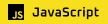
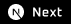

<h1 align="center">Oi, eu sou o Ademir! 👋</h1>

  Sou um engenheiro de software apaixonado por criar soluções inovadoras e acessíveis. Com formação em Ciência da Computação, busco constantemente aprimorar minhas habilidades e entregar projetos de alta qualidade.

  
  

## 🚀 Sobre Mim

- 🔭 Sou um **Engenheiro de Software** com sólida formação em Ciência da Computação, focado na criação de aplicações web robustas e escaláveis.
- 🌱 Atualmente aprofundando meus conhecimentos em **arquitetura de software** e **sistemas distribuídos**, enquanto exploro o desenvolvimento de aplicações mobile, desktop, integração IA e novas tecnologias do ecossistema web.

## 🛠️ Tecnologias e Ferramentas

### Linguagens

  
  
  
  

### Front-end

  
  
  
  
  
  

### Back-end

  
  
  
  
  

### Testes

  
  
  
  
  
  

### Ferramentas & DevOps

  
  
  
  

## ✨ Projetos em Destaque

<h3 align="center">
  <a href="https://github.com/Azganoth/portfolio" target="_blank">Portfolio Pessoal</a>
</h3>

Portfolio pessoal interativo para demonstrar minhas habilidades e projetos, utilizando SvelteKit e TypeScript. O site possui um design imersivo com fundo animado, gerenciamento de conteúdo simplificado através de arquivos Markdown e foco na experiência de usuário. [Acesse o site](https://azganoth.vercel.app/)

<h3 align="center">
  <a href="https://github.com/Azganoth/tree-sitter-lua" target="_blank">Tree Sitter Lua</a>
</h3>

Gramática completa da linguagem Lua (5.4) para o parser Tree-sitter. Inclui um scanner externo em C para regras complexas e gera bindings para Node.js, Rust e Swift, sendo consumível em múltiplos ecossistemas.

<h3 align="center">
  <a href="https://github.com/Azganoth/nexus" target="_blank">Nexus</a>
</h3>

Plataforma full-stack completa para gerenciamento de links, com dashboard interativo, autenticação segura e pré-visualização em tempo real. Utiliza Next.js, React, TypeScript, Node.js, Express, Prisma, e o deploy é automatizado com Docker e GitHub Actions. [Acesse o site](https://nexusapp.fly.dev/)

<h3 align="center">
  <a href="https://github.com/Azganoth/simple-motion-react" target="_blank">Simple Motion React</a>
</h3>

Biblioteca de animação declarativa para React com zero dependências, inspirada na API de transição do Vue. O código possui cobertura de testes completa com Jest e Testing Library, componentes documentados com Storybook e processo de build e publicação no NPM automatizado. [Acesse a documentação](https://simple-motion-react.vercel.app/)
